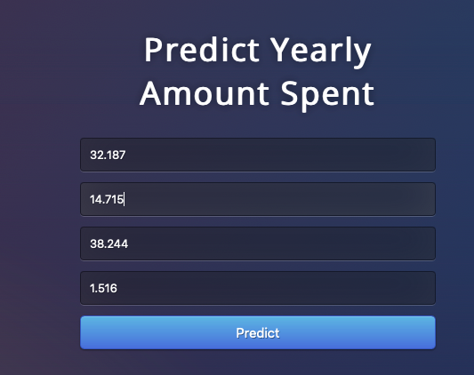
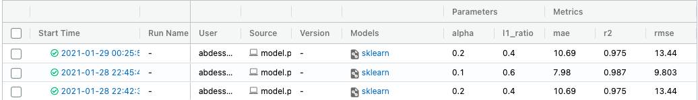

## ElasticNet Regression Model Deployement and Tracking using Mlflow
this is a project on a deployement of a machine learning model using flask and tracking the performance of the model using mlflow

### Prerequisites
You must have an IDE(best to use pycharm), Scikit Learn, Pandas, mlflow, Flask.
You can use the graphic interface to download the libraries or pip install

### Project Structure
1. model.py - this python file contains the code for our regression model and the tracking of the metrics and the parameters using mlflow 
2. app.py - this file contains Flask APIs that receives the average session length,time on app,time on website and length of membership through the frontend webpage and then our model computes the precited value 
3. index.html - this html contains the code for our frontend where we will enter the values of our variables then the result predicted by the model is dislayed 

### Running the project
1. First thing we open the project using pycharm
2. We install all of the necessary libraries we just saw above using preferences or pip install or we can just install on installing all the present dependencies present in the requirement.txt file
3. we compile the file containing our regression model using the following command
```
python model.py
```
we compiled our model, and we saved it to disk in a file named model.pkl1

4.we Run app.py which start our Flask API
```
python app.py
```

5.After we run our app.py file we will get the port in which our app is running we just click on it, and we get access to our webpage. 
we should be able to view the homepage as below in which we enter valid numerical values in all 4 input boxes and hit Predict.  




the we can see the result predicted by our model.  


6.Now that we deployed our model and tested it, we will be tracking our machine learning model using mlflow, we start of by accessing the graphical interface of mlflow by using the following command in the terminal
```
mlflow ui
```

7.The idea behind mlflow is to track the performance of our model by tracking the metrics and the parameters, so the next step is to compile our project using the command in below and then we just refresh our mlflow graphical interface to see the stored data about paramaters and metrics and we just keep on changing the parameters and then we can easily pick the parameters that gave us the best result
```
pyton train.py {alpha} {l1_ratio}
```
examples:
```
python model.py 0.1 0.6
```
```
python model.py 0.4 0.2
```
8. Once we compiled our model with different parameters we just refresh the mlflow graphical interface and we will the parameters and the metrics of our model stored  and we can pick the best performing model. 


